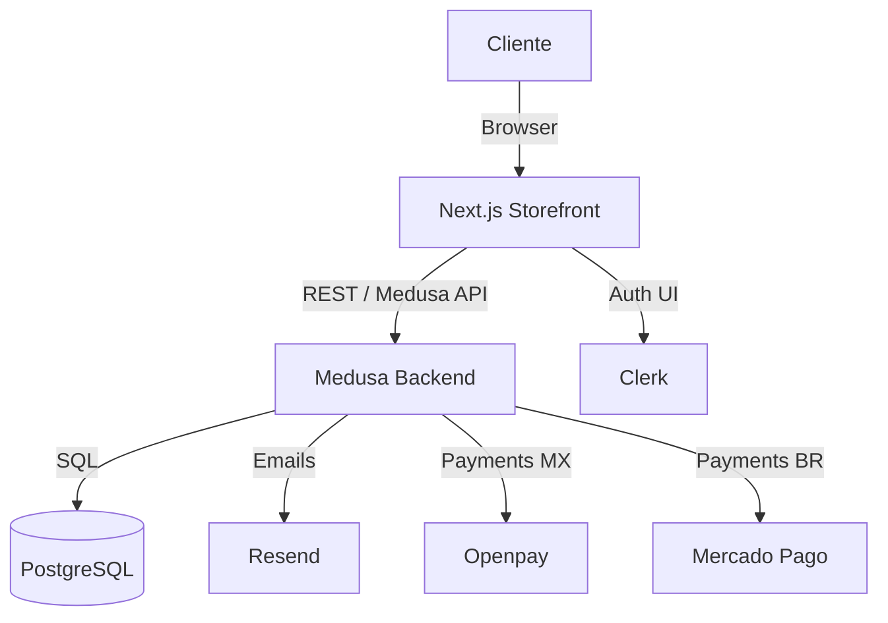
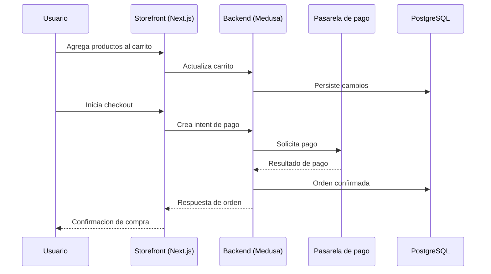
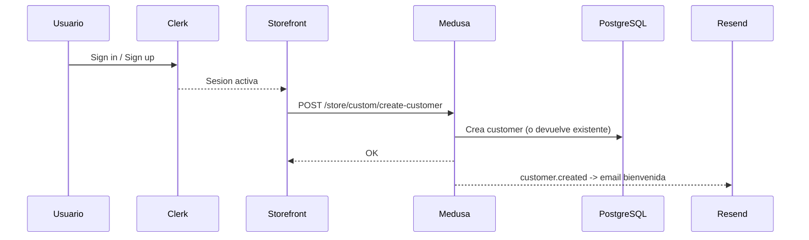
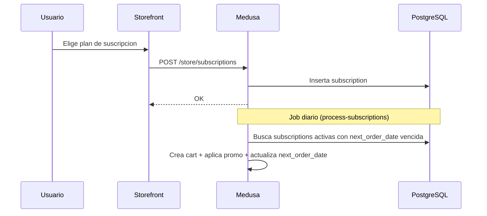
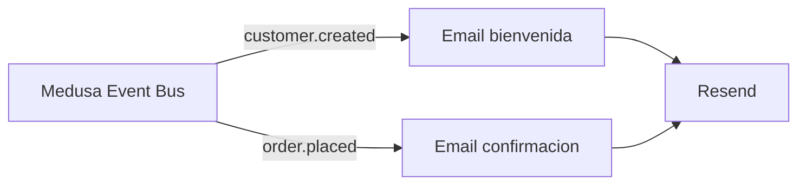

# Novapatch
Subscription-based e-commerce platform dedicated to the sale of medical patches with different benefits for users.

## Guia rapida (ES)

### Requisitos

* Node.js (v18 o superior)
* npm (o pnpm/yarn)
* Docker & Docker Compose

### Como correr en local

1) Variables de entorno
```bash
cp .env.example commerce-storefront/.env.local
cp .env.example commerce/.env
```

2) Base de datos (PostgreSQL)
```bash
docker-compose up -d database
```

3) Backend (Medusa)
```bash
cd commerce
npm install
npm run build
npm run dev
```

4) Frontend (Next.js)
```bash
cd commerce-storefront
npm install
npm run dev
```

Servicios locales:
- Storefront: http://localhost:8000
- Backend API: http://localhost:9000
- Admin: http://localhost:9000/app

## Arquitectura del sistema

Componentes principales:
- `commerce-storefront/`: Next.js 15 (UI, rutas, i18n)
- `commerce/`: Medusa.js (API, workflows, integraciones)
- PostgreSQL: base de datos
- Integraciones externas: Clerk (auth), Resend (emails), Openpay y Mercado Pago (pagos)



Notas de i18n y rutas:
- El storefront usa rutas por pais: `/mx/*` y `/br/*`
- `commerce-storefront/src/middleware.ts` asigna `x-next-intl-locale`
- `commerce-storefront/src/i18n.ts` carga mensajes desde `commerce-storefront/translations/*.json`

## Mapa rapido (donde esta cada cosa)

Checkout (frontend):
- Pagina: `commerce-storefront/src/app/[countryCode]/(checkout)/checkout/page.tsx`
- UI de pago: `commerce-storefront/src/modules/checkout/components/payment/index.tsx`
- Boton pago (MP/Openpay): `commerce-storefront/src/modules/checkout/components/payment-button/index.tsx`
- Exito/poller: `commerce-storefront/src/modules/checkout/components/success-poller/index.tsx`

Checkout (backend):
- Completar orden: `commerce/src/api/store/payment/complete-order/route.ts`
- Preferencia MP: `commerce/src/api/store/payment/preference/route.ts`
- Cargo Openpay: `commerce/src/api/store/payment/openpay-charge/route.ts`
- Webhooks pagos: `commerce/src/api/store/payment/webhooks/route.ts`
- Estado orden/pago: `commerce/src/api/store/payment/order-status/route.ts`

## Flujos principales

### Checkout (alto nivel)


### Autenticacion (Clerk) y sincronizacion con Medusa

Resumen:
- La autenticacion del usuario se hace 100% con Clerk (`/sign-in` y `/sign-up`).
- El storefront monta `ClerkProvider` en `commerce-storefront/src/app/layout.tsx`.
- Al iniciar sesion, `ClerkMedusaSyncProvider` ejecuta `useClerkMedusaSync`.
- Este hook llama a `POST /store/custom/create-customer` para crear/sincronizar el customer en Medusa.
- El backend emite `customer.created` y se dispara el email de bienvenida con Resend.



Notas:
- El endpoint `POST /store/custom/create-customer` aplica rate limit y valida email.
- Si el usuario ya existe, retorna el customer actual y no falla.

### Suscripciones

Datos y configuracion:
- Planes en tabla `subscription_plan` (se filtran los activos).
- Suscripciones en tabla `subscription` con `next_order_date` y estado.
- Endpoint para planes: `GET /store/subscription-plans`.

Endpoints principales:
- `POST /store/subscriptions` crea una suscripcion.
- `GET /store/subscriptions?customer_id=...` lista por cliente.
- `GET /store/subscriptions/:id` obtiene detalle.
- `PATCH /store/subscriptions/:id` actualiza plan/productos/estado.
- `POST /store/subscriptions/:id/pause` pausa.
- `POST /store/subscriptions/:id/cancel` cancela.
- `GET /admin/subscriptions/:id` y `PATCH /admin/subscriptions/:id` para admin.

Workflow interno:
- `create-subscription` crea registro y guarda metadata en customer.
- `update-subscription` actualiza estado/plan y metadata.
- Job diario `process-subscriptions` (cron `0 0 * * *`) procesa las suscripciones activas.
- `process-subscription-order` crea un cart, agrega items, aplica promo y actualiza `next_order_date`.



### Emails (Resend)

Eventos que envian emails:
- `customer.created` -> email de bienvenida.
- `order.placed` -> confirmacion de pedido.

Configuracion:
- Resend usa `RESEND_API_KEY`.
- Remitentes configurables via `RESEND_FROM_EMAIL_*`.
- Utilidad para probar: `npm run util:test-email` en `commerce/`.



### Pagos (Openpay MX / Mercado Pago BR)

Seleccion por region:
- `mx` -> Openpay
- `br` -> Mercado Pago
- Configuracion en `commerce/src/modules/payment-gateway/config/region-config.ts`.

Endpoints de pago:
- `POST /store/payment/preference` (Mercado Pago).
- `POST /store/payment/openpay-charge` (Openpay).
- `POST /store/payment/complete-order` (cierre de orden).
- `POST /store/payment/webhooks` (webhooks proveedores).
- `GET /store/payment/config` (public key MP).
- `GET /store/payment/order-status` (estado de orden/pago).

Frontend:
- La UI de pago vive en `commerce-storefront/src/modules/checkout/components/payment`.
- Openpay carga script via `commerce-storefront/src/components/shared/openpay-script.tsx`.

### Jobs y procesos

- Job `process-subscriptions` corre diariamente a medianoche (cron `0 0 * * *`).
- En produccion es recomendable usar Redis y worker dedicado (`MEDUSA_WORKER_MODE`).

## Setup & Installation

### 1. Clone the Repository
```bash
git clone <repository-url>
cd novapatchecommerce
```

## Project Structure

```
novapatchecommerce/
├── commerce/                 # Medusa.js Backend
│   ├── src/                 # Backend source code
│   ├── package.json         # Backend dependencies
│   └── .env                 # Backend environment variables
├── commerce-storefront/     # Next.js Frontend
│   ├── src/                 # Frontend source code
│   ├── package.json         # Frontend dependencies
│   └── .env.local           # Frontend environment variables
├── docker-compose.yml       # Docker services
└── .env.example            # Environment variables template
```

## Available Scripts

### Backend (commerce/)
```bash
npm run dev          # Start development server
npm run build        # Build for production
npm run start        # Start production server
npm run seed         # Seed database with sample data
```

### Frontend (commerce-storefront/)
```bash
npm run dev          # Start development server
npm run build        # Build for production
npm run start        # Start production server
npm run lint         # Run ESLint
```

### Common Issues

**Database Connection Error:**
```bash
# Make sure PostgreSQL is running
docker-compose up -d database

# Check if the database is accessible
docker-compose logs database
```

## License

This project is proprietary software for NovaPatch.
